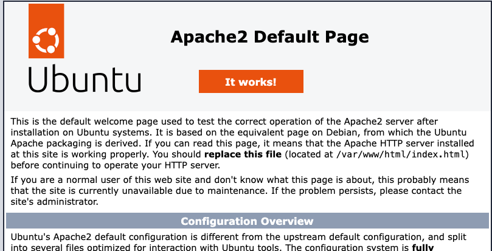
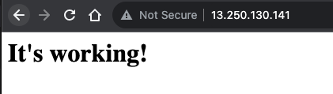
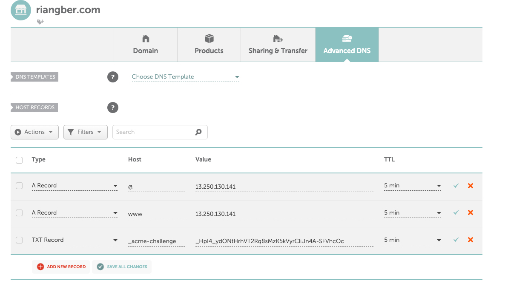
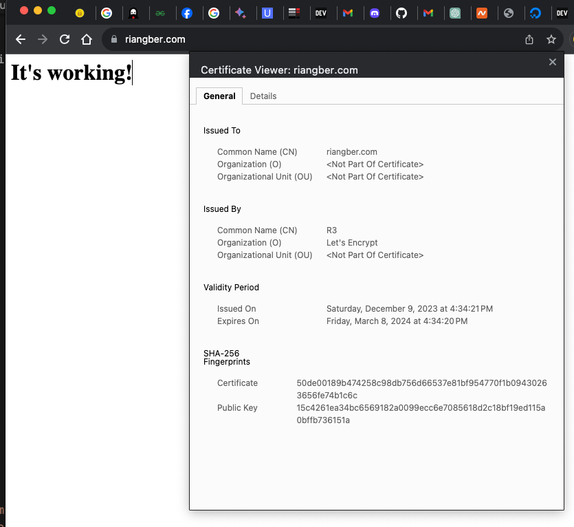

# Apache + Let's encrypt
This tutorial is a comprehensive guide for setting up both an Apache web server and Let's Encrypt SSL certificates on an EC2 instance running Ubuntu. It's divided into two parts:

Prequisite: -
- Up and running EC2 instance (Ubuntu 20-22) with associated Elastic IP.
- Domain. Get one from domain registra if you don't have any. Please note that I will use riangber.com as my domain.
- Basic knownledge of linux cli 😎

## Part 1 - Apache
This section focuses on installing Apache on the EC2 instance and configuring it to serve a basic web page.

reference & credit: https://www.digitalocean.com/community/tutorials/how-to-install-the-apache-web-server-on-ubuntu-20-04

### 1.1  - Package installation & firewall configuration
Shows how to install Apache, configure the firewall (UFW) to allow necessary ports (like 80 and 443), and check if Apache is running.

SSH to ec2 instance

```bash
ssh ubuntu@<ip-address>

# to access with specific private key
ssh -i your-private-key.pem ubuntu@<ip-address>
```

Install apache

```bash
sudo apt update

sudo apt install apache2
```

Configure ufw firewall

```bash
# list available application profile
sudo ufw app list

# allow port 22, 80 and 443
sudo ufw allow ssh
sudo ufw allow 'Apache Full'

# enable ufw if not already
sudo ufw enable
sudo systemctl restart ufw

# check firewall status
sudo ufw status
```

Check if apache service is running
```bash
sudo systemctl status apache2
# Output
# ● apache2.service - The Apache HTTP Server
#      Loaded: loaded (/lib/systemd/system/apache2.service; enabled; vendor preset: enabled)
#      Active: active (running) since Sat 2023-12-09 09:45:39 UTC; 9min ago
#        Docs: https://httpd.apache.org/docs/2.4/
#    Main PID: 3343 (apache2)
#       Tasks: 55 (limit: 517)
#      Memory: 6.4M
#         CPU: 61ms
#      CGroup: /system.slice/apache2.service
#              ├─3343 /usr/sbin/apache2 -k start
#              ├─3345 /usr/sbin/apache2 -k start
#              └─3346 /usr/sbin/apache2 -k start

# Dec 09 09:45:39 ip-172-31-1-234 systemd[1]: Starting The Apache HTTP Server...
# Dec 09 09:45:39 ip-172-31-1-234 systemd[1]: Started The Apache HTTP Server.
```

Go to `http://<ip-address>` you should see something like this




### 1.2 - Setting up virtual host
Guides through creating a directory for the domain, adding an index HTML file, setting up a virtual host for the domain, and enabling it while disabling the default Apache site.

Create directory & html file
```bash
# create new directory and change ownership (from root to ubuntu)
sudo mkdir /var/www/riangber.com
sudo chown -R $USER:$USER /var/www/riangber.com

# add new index.html file
sudo vim /var/www/riangber.com/index.html

# content of index.html
<html>
    <head>
        <title>Welcome!</title>
    </head>
    <body>
        <h1>It's working!</h1>
    </body>
</html>
```

Configure sites-avialble, sites-enabled
```bash
sudo vim /etc/apache2/sites-available/riangber.com.conf

# Add this
<VirtualHost *:80>
    ServerAdmin sirawit.mn@gmail.com
    ServerName riangber.com
    ServerAlias www.riangber.com
    DocumentRoot /var/www/riangber.com
    ErrorLog ${APACHE_LOG_DIR}/error.log
    CustomLog ${APACHE_LOG_DIR}/access.log combined
</VirtualHost>
```
Enable our new site & disable default apache site
```bash
sudo a2ensite riangber.com.conf
sudo a2dissite 000-default.conf
```

Test for error
```bash
sudo apache2ctl configtest
# Output
# Syntax OK
```

Restart apache
```bash
sudo systemctl restart apache2
```

Result


<br>
<br>

## Part 2 - Let's encrypt
This part covers obtaining SSL certificates from Let's Encrypt and configuring Apache to use these certificates for secure HTTPS connections.

reference & credit: https://www.geeksforgeeks.org/using-certbot-manually-for-ssl-certificates/

### 2.1 Install certbot & obtain certficate :)
Demonstrates the installation of Certbot and manually obtaining a certificate from Let's Encrypt. It involves creating a DNS TXT record for domain verification, waiting for DNS propagation, and finally obtaining the SSL certificate.

Install certbot
```bash
sudo apt-get install certbot
```

Manually obtain certificate

```bash
sudo certbot certonly 
 --manual \
 -d riangber.com \
 --agree-tos \
 --manual-public-ip-logging-ok \
 --preferred-challenges dns-01 \
 --server https://acme-v02.api.letsencrypt.org/directory \
 --register-unsafely-without-email \
 --rsa-key-size 4096 \
```

Output
```bash
 Saving debug log to /var/log/letsencrypt/letsencrypt.log
Account registered.
Requesting a certificate for riangber.com

- - - - - - - - - - - - - - - - - - - - - - - - - - - - - - - - - - - - - - - -
Please deploy a DNS TXT record under the name:

_acme-challenge.riangber.com.

with the following value:

_HpI4_ydONtHrhVT2Rq8sMzK5kVyrCEJn4A-SFVhcOc

Before continuing, verify the TXT record has been deployed. Depending on the DNS
provider, this may take some time, from a few seconds to multiple minutes. You can
check if it has finished deploying with aid of online tools, such as the Google
Admin Toolbox: https://toolbox.googleapps.com/apps/dig/#TXT/_acme-challenge.riangber.com.
Look for one or more bolded line(s) below the line ';ANSWER'. It should show the
value(s) you've just added.

- - - - - - - - - - - - - - - - - - - - - - - - - - - - - - - - - - - - - - - -
Press Enter to Continue
```
<br>

What we will do next, is to go to the domain registra and add TXT record like so: -


Now we wait for the DNS to propagate.....⏰

```bash
dig -t txt _acme-challenge.riangber.com # repalce with your domain

# Output
# ; <<>> DiG 9.10.6 <<>> -t txt _acme-challenge.riangber.com
# ;; global options: +cmd
# ;; Got answer:
# ;; ->>HEADER<<- opcode: QUERY, status: NOERROR, id: 58230
# ;; flags: qr rd ra; QUERY: 1, ANSWER: 1, AUTHORITY: 0, ADDITIONAL: 1

# ;; OPT PSEUDOSECTION:
# ; EDNS: version: 0, flags:; udp: 1232
# ;; QUESTION SECTION:
# ;_acme-challenge.riangber.com.	IN	TXT

# ;; ANSWER SECTION:
# _acme-challenge.riangber.com. 300 IN	TXT	"_HpI4_ydONtHrhVT2Rq8sMzK5kVyrCEJn4A-SFVhcOc"

# ;; Query time: 103 msec
# ;; SERVER: 1.1.1.1#53(1.1.1.1)
# ;; WHEN: Sat Dec 09 17:34:10 +07 2023
# ;; MSG SIZE  rcvd: 113
```

Then we will get result like this: -
```bash
Successfully received certificate.
Certificate is saved at: /etc/letsencrypt/live/riangber.com/fullchain.pem
Key is saved at:         /etc/letsencrypt/live/riangber.com/privkey.pem
This certificate expires on 2024-03-08.
These files will be updated when the certificate renews.

NEXT STEPS:
- This certificate will not be renewed automatically. Autorenewal of --manual certificates requires the use of an authentication hook script (--manual-auth-hook) but one was not provided. To renew this certificate, repeat this same certbot command before the certificate's expiry date.

- - - - - - - - - - - - - - - - - - - - - - - - - - - - - - - - - - - - - - - -
If you like Certbot, please consider supporting our work by:
 * Donating to ISRG / Let's Encrypt:   https://letsencrypt.org/donate
 * Donating to EFF:                    https://eff.org/donate-le
- - - - - - - - - - - - - - - - - - - - - - - - - - - - - - - - - - - - - - - -
```

### 2.2  Enable ssl module on apache & configure ssl

Enable ssl module
```bash
sudo a2enmod ssl
```

Go to apache2's sites-available
```bash
cd /etc/apache2/sites-available
```

Create new ssl config
```bash
# copy it
sudo cp default-ssl.conf riangber.com-ssl.conf

sudo vim riangber.com-ssl.conf
```

Replace these two lines  with Let's encrypt and it should look like this: -
```bash
SSLCertificateFile /etc/letsencrypt/live/riangber.com/fullchain.pem
SSLCertificateKeyFile /etc/letsencrypt/live/riangber.com/privkey.pem
```

Enable site
```bash
sudo a2ensite riangber.com-ssl.conf
```

Configure the existing virtual host
```bash
sudo vim riangber.com.conf

# add virtual host for ssl
<VirtualHost *:443>
    ServerAdmin sirawit.mn@gmail.com
    ServerName riangber.com
    ServerAlias www.riangber.com
    DocumentRoot /var/www/riangber.com
    ErrorLog ${APACHE_LOG_DIR}/error.log
    CustomLog ${APACHE_LOG_DIR}/access.log combined

    # SSL CONFIG
    SSLEngine on
    SSLCertificateFile /etc/letsencrypt/live/riangber.com/fullchain.pem
    SSLCertificateKeyFile /etc/letsencrypt/live/riangber.com/privkey.pem
</VirtualHost>
```

Restart apache
```bash
sudo systemctl restart apache2
```

It's working!
